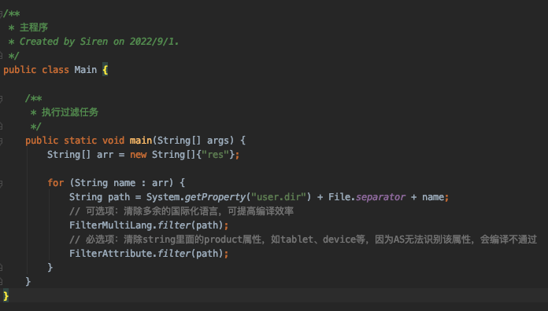
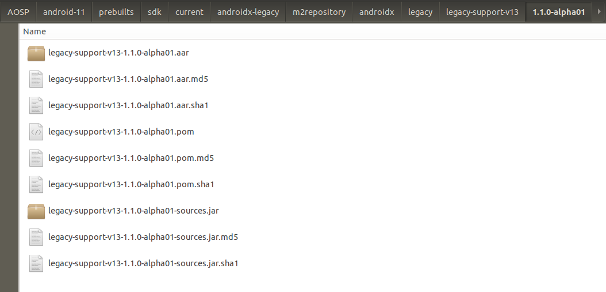

## DocumentsUI from android-11.0.0_r10
### DocumentsUI脱离源码在Android Studiod的编译

### 支持说明
* 不试图改变项目本身的目录结构
* 通过添加额外的配置和依赖构建Gradle环境支持
* 会使用脚本移除一些AS不支持的属性和字段，然后利用git本地忽略
* 会修改以下两处不支持运行的代码 (如下)

 

```
1. com.android.documentsui.DirectoryLoader
*********************************************************
//已经弃用的方法
//@Override
protected Executor getExecutor() {
    return ProviderExecutor.forAuthority(mRoot.authority);
}

2. com.android.documentsui.roots.ProvidersCache
********************************************************
public void updateAsync(boolean forceRefreshAll, @Nullable Runnable callback) {

    // NOTE: This method is called when the UI language changes.
    // For that reason we update our RecentsRoot to reflect
    // the current language.
    final String title = mContext.getString(R.string.root_recent);
    for (UserId userId : mUserIdManager.getUserIds()) {
        RootInfo recentRoot = createOrGetRecentsRoot(userId);
        recentRoot.title = title;
        // Nothing else about the root should ever change.
        assert (recentRoot.authority == null);
        assert (recentRoot.rootId == null);
        assert (recentRoot.derivedIcon == R.drawable.ic_root_recent);
        assert (recentRoot.derivedType == RootInfo.TYPE_RECENTS);
        //忽略此处断言，两边不相等，但是系统编出来的不会奔溃 !=_=
        //assert (recentRoot.flags == (Root.FLAG_LOCAL_ONLY | Root.FLAG_SUPPORTS_IS_CHILD));
        assert (recentRoot.availableBytes == -1);
    }

    new UpdateTask(forceRefreshAll, null, callback).executeOnExecutor(
            AsyncTask.THREAD_POOL_EXECUTOR);
}
```


## 执行步骤
#### 第一步：运行在Filter上的主函数，执行过滤任务


### 第二步：执行Android Studio上Build APK的操作, 然后将apk推送到设备上DocumentsUI所在的目录

```
adb push DocumentsUI.apk /system/priv-app/DocumentsUI/

adb shell killall com.android.documentsui
```
######  如果DocumentsUI不能正常起来，则需要重启一下设备
```
adb reboot
```


## 构建步骤

### Step1：引入静态依赖
##### @framework.jar:
```
// AOSP/android-11/out/target/common/obj/JAVA_LIBRARIES/framework_intermediates/classes-header.jar
compileOnly files('libs/framework.jar')
```


##### @guava.jar:
```
// AOSP/android-11/out/soong/.intermediates/external/guava/guava/android_common/turbine-combined/guava.jar
implementation files('libs/guava.jar')
```


##### @legacy-support-v13-1.1.0-alpha01.aar:
```
// AOSP/android-11/prebuilts/sdk/current/androidx-legacy/m2repository/androidx/legacy/legacy-support-v13/1.1.0-alpha01/legacy-support-v13-1.1.0-alpha01.aar
implementation(name: 'legacy-support-v13-1.1.0-alpha01', ext: 'aar')
```



###### ps: legacy-support-v13-1.1.0 在当前版本无法通过线上引用，故换成静态
```
## implementation 'androidx.legacy:legacy-support-v13-1.1.0-alpha01'
```


### Step2：引入代码
###### 导入一个特殊类DocumentsStatsLog，该类是自动生成的，可在out目录找到
```
// AOSP/android-11/out/soong/.intermediates/packages/apps/DocumentsUI/statslog-docsui-java-gen

sourceSets {
    main {
        java.srcDirs = ['src', 'statslog-docsui-java-gen/gen']
        res.srcDirs = ['res']
        manifest.srcFile 'AndroidManifest.xml'
    }
}
```


## 生成platform.keystore默认签名

在AOSP/android-11/build/target/product/security路径下找到签名证书，并使用 [keytool-importkeypair](https://github.com/getfatday/keytool-importkeypair) 生成keystore,
执行如下命令：  

```
./keytool-importkeypair -k platform.keystore -p 123456 -pk8 platform.pk8 -cert platform.x509.pem -alias platform
```

并将以下代码添加到gradle配置中：

```
    signingConfigs {
        platform {
            storeFile file("platform.keystore")
            storePassword '123456'
            keyAlias 'platform'
            keyPassword '123456'
        }
    }

    buildTypes {
        release {
            debuggable false
            minifyEnabled false
            signingConfig signingConfigs.platform
        }

        debug {
            debuggable true
            minifyEnabled false
            signingConfig signingConfigs.platform
        }
    }
```

### PS:
##### 查看被忽略的文件列表
```
git ls-files -v | grep '^h\ '
```  

##### 忽略和还原单个文件
``` 
git update-index --assume-unchanged $path
git update-index --no-assume-unchanged $path
``` 

##### 还原全部被忽略的文件
```
git ls-files -v | grep '^h' | awk '{print $2}' |xargs git update-index --no-assume-unchanged 
```

---

### 关联项目
* [Settings](https://github.com/siren-ocean/Settings)
* [SystemUI](https://github.com/siren-ocean/SystemUI)
* [Launcher3](https://github.com/siren-ocean/Launcher3)
* [Camera2](https://github.com/siren-ocean/Camera2)
