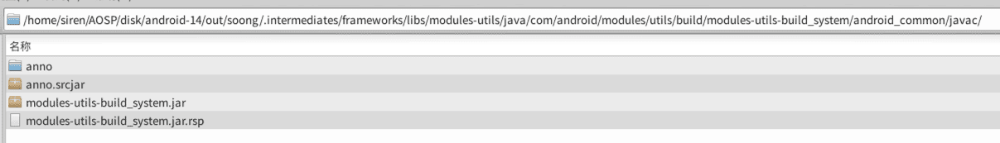

# English | [中文文档](README.cn.md)
## DocumentsUI from android-14.0.0_r67
### Building DocumentsUI outside AOSP source in Android Studio

### Support Notes
* Instead of changing the project's directory structure, we add additional configurations and dependencies to build Gradle environment support
* The following code modifications are required for proper operation (as shown below)


```
@PATH: src/com/android/documentsui/DirectoryLoader.java
*********************************************************
// Deprecated method
//@Override
protected Executor getExecutor() {
    return ProviderExecutor.forAuthority(mRoot.authority);
}

@PATH: src/com/android/documentsui/roots/ProvidersCache.java
public void updateAsync(boolean forceRefreshAll, @Nullable Runnable callback) {
    // NOTE: This method is called when the UI language changes.
    // For that reason we update our RecentsRoot to reflect
    // the current language.
    final String title = mContext.getString(R.string.root_recent);
    for (UserId userId : mUserIdManager.getUserIds()) {
        RootInfo recentRoot = createOrGetRecentsRoot(userId);
        recentRoot.title = title;
        // Nothing else about the root should ever change.
        assert (recentRoot.authority == null);
        assert (recentRoot.rootId == null);
        assert (recentRoot.derivedIcon == R.drawable.ic_root_recent);
        assert (recentRoot.derivedType == RootInfo.TYPE_RECENTS);
        // This assertion will crash in debug mode, comment it out
        // assert (recentRoot.flags == (Root.FLAG_LOCAL_ONLY | Root.FLAG_SUPPORTS_IS_CHILD));
        assert (recentRoot.availableBytes == -1);
    }

    new MultiProviderUpdateTask(forceRefreshAll, null, callback).executeOnExecutor(
            AsyncTask.THREAD_POOL_EXECUTOR);
}
```

## Building with Command Line
### Environment Requirements
*  Gradle 8.7
*  JDK version 17

```
# Setup build environment
gradle wrapper

# Build and package
./gradlew assemble
```


## Building in Android Studio

#### Execute Build APK in Android Studio, then push the apk to the DocumentsUI directory on the device

```
adb push DocumentsUI.apk /system/priv-app/DocumentsUI/

adb shell killall com.android.documentsui
```
### PS: The first push may not start properly, you need to reboot the device.
```
adb reboot
```


## Build Steps

### Step 1: Add Static Dependencies

##### @framework.jar:
```
// android-14/out/target/common/obj/JAVA_LIBRARIES/framework_intermediates/classes-header.jar
compileOnly files('libs/framework.jar')
```


##### @modules-utils-build_system.jar:
```
// android-14/out/soong/.intermediates/frameworks/libs/modules-utils/java/com/android/modules/utils/build/modules-utils-build_system/android_common/javac/modules-utils-build_system.jar
implementation files('libs/modules-utils-build_system.jar')
```



### Step 2: Add Code
#### Import a special class DocumentsStatsLog, which is auto-generated and can be found in the out directory
```
// android-14/out/soong/.intermediates/packages/apps/DocumentsUI/statslog-docsui-java-gen

sourceSets {
    main {
        java.srcDirs = ['src', 'statslog-docsui-java-gen/gen']
        res.srcDirs = ['res']
        manifest.srcFile 'AndroidManifest.xml'
    }
}
```


## Generate platform.keystore Default Signature

Find the signing certificates in the android-14/build/target/product/security path and use [keytool-importkeypair](https://github.com/getfatday/keytool-importkeypair) to generate the keystore.
Execute the following command:  

```
./keytool-importkeypair -k platform.keystore -p 123456 -pk8 platform.pk8 -cert platform.x509.pem -alias platform
```

And add the following code to the gradle configuration:

```
    signingConfigs {
        platform {
            storeFile file("platform.keystore")
            storePassword '123456'
            keyAlias 'platform'
            keyPassword '123456'
        }
    }

    buildTypes {
        release {
            debuggable false
            minifyEnabled false
            signingConfig signingConfigs.platform
        }

        debug {
            debuggable true
            minifyEnabled false
            signingConfig signingConfigs.platform
        }
    }
```

---

### Related Projects
* [Settings](https://github.com/siren-ocean/Settings)
* [SystemUI](https://github.com/siren-ocean/SystemUI)
* [Launcher3](https://github.com/siren-ocean/Launcher3)
* [Camera2](https://github.com/siren-ocean/Camera2)
* [PermissionController](https://github.com/siren-ocean/PermissionController)
